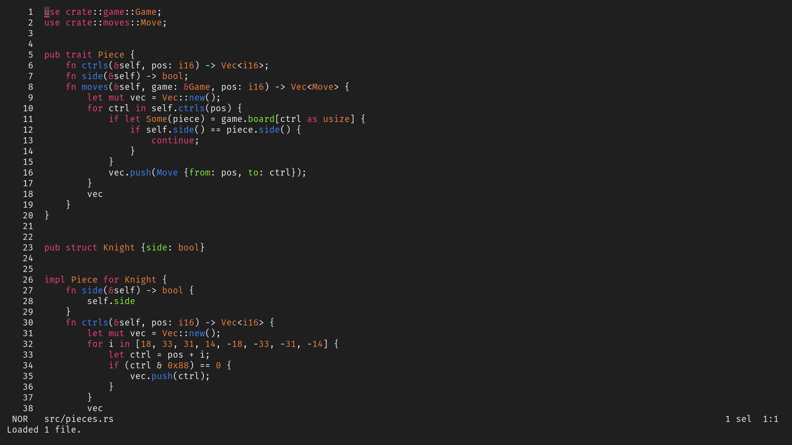

# Payne

## Themes

### Dark

- #1f1f1f (background)
- #efefef (foreground)
- #3f3f3f (extra)

### Light

- #efefef (background)
- #1f1f1f (foreground)
- #dfdfdf (extra)

## Colors

- #efefef (red)
- #7fef3f (green)
- #7f3fef (yellow)
- #ef3f7f (magenta)
- #3f7fef (blue)
- #3fef7f (cyan)

## Values

- 0f
- 3f
- 7f
- bf
- ef
- 1f
- df

## Calculations

1 -> 00, 256 -> ff

- 2 ^ 4 = 16 -> 0f
- 2 ^ 5 = 32 -> 1f
- 2 ^ 6 = 64 -> 3f
- 2 ^ 7 = 128 -> 7f
- 2 ^ 8 - 2 ^ 6 = 192 -> bf
- 2 ^ 8 - 2 ^ 5 = 224 -> df
- 2 ^ 8 - 2 ^ 4 = 240 -> ef
